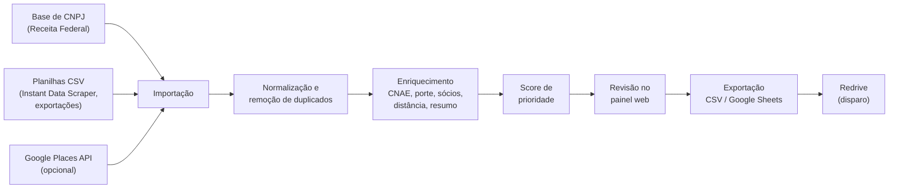

<div align="center">

# PCI-LEADS

**Sistema de prospecção de leads da PCI — Projetos e Consultoria Integrada**

Encontrar, enriquecer, priorizar e organizar empresas do Distrito Federal para o processo de prospecção da PCI.


</div>

---

## Sumário

- [Sobre o projeto](#sobre-o-projeto)
- [Como o sistema funciona](#como-o-sistema-funciona)
- [Status atual](#status-atual)
- [Dados de cada lead](#dados-de-cada-lead)
- [Fontes de dados](#fontes-de-dados)
- [Stack](#stack)
- [Estrutura de pastas](#estrutura-de-pastas)
- [Como rodar o projeto](#como-rodar-o-projeto)
- [Variáveis de ambiente](#variáveis-de-ambiente)
- [API](#api)
- [Comandos úteis](#comandos-úteis)
- [Roadmap](#roadmap)
- [LGPD e boas práticas](#lgpd-e-boas-práticas)
- [Como contribuir](#como-contribuir)
- [Equipe](#equipe)

---

## Sobre o projeto

A **PCI — Projetos e Consultoria Integrada** é uma Empresa Júnior. Hoje, a prospecção de clientes é feita quase toda à mão: procurar empresas por região, pesquisar informações sobre cada uma, organizar os contatos numa planilha e escrever as mensagens.

O **PCI-LEADS** é um projeto interno que automatiza essa preparação. O objetivo é gerar uma **lista de leads organizada, enriquecida e priorizada**, pronta para ser exportada (CSV / Google Sheets) e usada no disparo de mensagens pela ferramenta **[Redrive](https://redrive.com.br/)**.

### Problemas que o sistema resolve

| Hoje (manual) | Com o PCI-LEADS |
|---|---|
| Procurar empresas região por região | Busca e importação de empresas filtradas por ramo e localização |
| Pesquisar cada empresa individualmente | Enriquecimento automático com dados públicos do CNPJ |
| Organizar contatos em planilhas soltas | Base única, sem duplicados, com status de cada lead |
| Escolher "no feeling" quem contatar primeiro | Score de prioridade baseado no histórico da PCI |
| Escrever cada mensagem do zero | Resumo da empresa e mensagem personalizada gerados para cada lead |

### Público-alvo da prospecção

- Pequenos negócios do **Distrito Federal** (pet shops, salões de beleza, barbearias, papelarias, entre outros);
- Telefones com **DDD 61**;
- Prioridade para empresas **mais próximas da Asa Norte**.

---

## Como o sistema funciona

Fluxo planejado, das fontes de dados até o disparo:



> **Importante:** o sistema **não envia mensagens**. Ele prepara e organiza os leads; o disparo fica a cargo da Redrive.

---

## Status atual

O projeto está na **fase inicial**: a estrutura base (backend, frontend, banco e Docker) está pronta, e as funcionalidades de prospecção estão sendo construídas.

**Já existe**

- [x] Ambiente completo com Docker Compose (backend, frontend e PostgreSQL)
- [x] API REST com CRUD de leads (`/api/leads/`)
- [x] Painel de administração do Django para leads
- [x] Tela inicial com formulário de busca e tabela de resultados
- [x] Endpoint de busca (`/api/leads/search/`) — **ainda retorna lista vazia**

**Ainda não existe** (ver [Roadmap](#roadmap))

- [ ] Fontes de dados reais (Receita Federal, CSV, Google Places)
- [ ] Modelo de dados completo (CNPJ, CNAE, sócios, telefones, score…)
- [ ] Filtros, paginação e exportação
- [ ] Autenticação
- [ ] Score de prioridade

---

## Dados de cada lead

Informações definidas pela equipe e de onde cada uma pode vir:

| # | Informação | Fonte prevista | Observações |
|---|---|---|---|
| 1 | **Ramo da empresa** | CNAE principal (Receita Federal) | Uma tabela traduz o código CNAE para o "ramo PCI". Ex.: `9602-5/01` → Salão / Barbearia; `4761-0/03` → Papelaria; `9609-2/08` → Pet shop (banho e tosa) |
| 2 | **Nome da empresa** | Nome fantasia (Receita) ou nome no Google | O nome fantasia pode vir em branco; nesse caso usa-se a razão social |
| 3 | **Resumo da empresa** | Gerado por IA | A partir do CNAE, da categoria no Google e do site/Instagram, quando houver |
| 4 | **Telefone (61)** | Receita Federal e/ou Google | Filtrar DDD 61 **e** celular (9 dígitos começando com 9), já que o contato é via WhatsApp |
| 5 | **Dados da Receita / CNPJ** | Base aberta do CNPJ | Razão social, CNAEs, natureza jurídica, porte, capital social, data de abertura, situação cadastral, Simples/MEI, endereço, e-mail |
| 6 | **Pessoa de contato** | Quadro de sócios (Receita) | Nome, qualificação e **faixa etária** do sócio. Gênero **não** consta na base |
| 7 | **Localização** | Endereço/CEP (Receita) ou coordenadas (Google) | Cálculo de distância até a Asa Norte para priorização |

### O que **não** é possível obter

- **Faturamento anual:** não é público. A aproximação possível é o **porte** (ME: até R$ 360 mil/ano; EPP: até R$ 4,8 milhões/ano) e o indicador de **MEI**. O porte é autodeclarado e pode estar desatualizado.
- **Gênero do contato:** não existe na base da Receita; só pode ser estimado pelo primeiro nome, com margem de erro.

---

## Fontes de dados

| Fonte | O que oferece | Custo | Situação |
|---|---|---|---|
| **[Dados abertos do CNPJ](https://www.gov.br/receitafederal/dados/cnpj-metadados.pdf)** (Receita Federal) | Empresas, estabelecimentos, sócios e Simples/MEI de todo o Brasil; atualizada periodicamente | Gratuita | Fonte principal planejada |
| **Importação de CSV** | Planilhas exportadas da extensão **Instant Data Scraper** ou de outras ferramentas | Gratuita | Planejada |
| **Google Places API** | Nome, telefone, site, avaliação e coordenadas de negócios no mapa | Cota gratuita mensal; depois, pago por requisição | Opcional / em avaliação |
| **Redrive** | Ferramenta de disparo via WhatsApp; também possui captação própria de contatos | Assinatura | Formato de importação **a confirmar** |

### Sobre o Instant Data Scraper

O [Instant Data Scraper](https://chromewebstore.google.com/detail/instant-data-scraper/ofaokhiedipichpaobibbnahnkdoiiah) é uma extensão do Chrome que exporta tabelas de páginas da web em CSV/XLSX. Ela **não possui API**, então a integração com o PCI-LEADS será feita por uma **tela de importação de CSV** com mapeamento de colunas.

### Pendências sobre a Redrive

Antes de implementar a exportação, precisamos confirmar com a Redrive:

1. Aceita importação de CSV ou Google Sheets? Com quais colunas?
2. Permite variáveis por contato na mensagem (ex.: `{nome_contato}`, `{mensagem}`)?
3. Possui API ou webhook para devolver o status do envio e das respostas?
4. Usa a API oficial do WhatsApp?
5. A captação própria de CNPJ dela filtra por CNAE e bairro?

---

## Stack

| Camada | Tecnologias |
|---|---|
| **Backend** | Python 3.12, Django 5.2, Django REST Framework, django-cors-headers |
| **Banco de dados** | PostgreSQL 16 |
| **Frontend** | React 19, TypeScript, Vite 7, Tailwind CSS 4, Axios |
| **Infraestrutura** | Docker, Docker Compose, Git/GitHub |

---

## Estrutura de pastas

```text
PCI-LEADS/
├── backend/
│   ├── config/                 # Configurações do projeto Django
│   │   ├── settings.py         # Banco, apps instalados, CORS, DRF
│   │   └── urls.py             # Rotas principais (/admin e /api/leads)
│   ├── apps/
│   │   └── leads/              # App de leads
│   │       ├── models.py       # Modelo Lead
│   │       ├── serializers.py  # Serialização para a API
│   │       ├── views.py        # Endpoints (CRUD e busca)
│   │       ├── services.py     # Lógica de busca de leads (a implementar)
│   │       ├── urls.py         # Rotas do app
│   │       ├── admin.py        # Configuração do Django Admin
│   │       └── tests.py        # Testes
│   ├── manage.py
│   ├── requirements.txt
│   └── Dockerfile
├── frontend/
│   ├── src/
│   │   ├── components/         # Header, SearchForm, LeadTable, LeadCard
│   │   ├── pages/              # Home (busca) e Leads (leads salvos)
│   │   ├── services/api.ts     # Cliente Axios e chamadas à API
│   │   ├── types/lead.ts       # Tipagem do Lead
│   │   ├── App.tsx
│   │   └── main.tsx
│   ├── package.json
│   ├── vite.config.ts
│   └── Dockerfile
├── scripts/
│   └── criar_issues.py         # Cria as issues do projeto no GitHub
├── docker-compose.yml
├── .env.example                # Modelo das variáveis de ambiente
└── README.md
```

---

## Como rodar o projeto

### Pré-requisitos

- [Docker](https://docs.docker.com/get-docker/) e [Docker Compose](https://docs.docker.com/compose/)
- [Git](https://git-scm.com/)

### 1. Clonar o repositório

```bash
git clone <url-do-repositorio>
cd PCI-LEADS
```

### 2. Criar o arquivo `.env`

```bash
cp .env.example .env
```

Depois, edite o `.env` e troque os valores `change-me` por senhas próprias (veja [Variáveis de ambiente](#variáveis-de-ambiente)).

> ⚠️ O `.env` contém senhas e **nunca** deve ser enviado ao GitHub nem compartilhado em arquivos `.zip`. Ele já está no `.gitignore`.

### 3. Subir os containers

```bash
docker compose up --build
```

### 4. Aplicar as migrações do banco

Em outro terminal, com os containers rodando:

```bash
docker compose exec backend python manage.py makemigrations
docker compose exec backend python manage.py migrate
```

### 5. Criar um usuário administrador

```bash
docker compose exec backend python manage.py createsuperuser
```

### 6. Acessar

| Serviço | Endereço |
|---|---|
| Frontend | http://localhost:5173 |
| API | http://localhost:8000/api/leads/ |
| Django Admin | http://localhost:8000/admin/ |
| PostgreSQL | `localhost:5432` |

### Parar o projeto

```bash
docker compose down        # para os containers
docker compose down -v     # para e APAGA o banco de dados (volume)
```

---

## Variáveis de ambiente

Definidas no arquivo `.env` na raiz do projeto:

| Variável | Descrição | Exemplo |
|---|---|---|
| `POSTGRES_DB` | Nome do banco de dados | `pcleads` |
| `POSTGRES_USER` | Usuário do banco | `pcleads` |
| `POSTGRES_PASSWORD` | Senha do banco | `uma-senha-forte` |
| `DB_HOST` | Host do banco (nome do serviço no Docker) | `database` |
| `DB_PORT` | Porta do banco | `5432` |
| `DJANGO_DEBUG` | Modo debug do Django (`True` só em desenvolvimento) | `True` |
| `DJANGO_SECRET_KEY` | Chave secreta do Django | `uma-chave-longa-e-aleatoria` |

O frontend usa `VITE_API_URL` (já definida no `docker-compose.yml` como `http://localhost:8000/api`).

---

## API

Base: `http://localhost:8000/api`

| Método | Rota | Descrição |
|---|---|---|
| `GET` | `/leads/` | Lista todos os leads |
| `POST` | `/leads/` | Cria um lead |
| `GET` | `/leads/{id}/` | Detalha um lead |
| `PUT` / `PATCH` | `/leads/{id}/` | Atualiza um lead |
| `DELETE` | `/leads/{id}/` | Remove um lead |
| `POST` | `/leads/search/` | Busca leads por segmento e cidade *(ainda retorna lista vazia)* |

**Exemplo — criar um lead**

```bash
curl -X POST http://localhost:8000/api/leads/ \
  -H "Content-Type: application/json" \
  -d '{"name": "Contato Teste", "company": "Empresa Teste", "phone": "61999999999", "city": "Brasília", "state": "DF"}'
```

**Exemplo — buscar leads**

```bash
curl -X POST http://localhost:8000/api/leads/search/ \
  -H "Content-Type: application/json" \
  -d '{"query": "pet shop", "city": "Brasília"}'
```

> A navegação pela API também pode ser feita no navegador, pela interface do Django REST Framework, acessando `http://localhost:8000/api/leads/`.

---

## Comandos úteis

| Ação | Comando |
|---|---|
| Ver logs | `docker compose logs -f backend` |
| Rodar os testes do backend | `docker compose exec backend python manage.py test` |
| Abrir o shell do Django | `docker compose exec backend python manage.py shell` |
| Acessar o banco (psql) | `docker compose exec database psql -U pcleads -d pcleads` |
| Instalar pacote no frontend | `docker compose exec frontend npm install <pacote>` |
| Recriar containers do zero | `docker compose up --build --force-recreate` |

> Ao adicionar uma dependência Python, inclua-a em `backend/requirements.txt` e rode `docker compose up --build`.

---

## Roadmap

### Fase 0 — Ajustes da base
- [ ] Corrigir o build do frontend (`npm run build`): import de tipo em `SearchForm.tsx` e criação do `src/vite-env.d.ts`
- [ ] Gerar e versionar as migrações iniciais
- [ ] Adicionar *healthcheck* do PostgreSQL no `docker-compose.yml`
- [ ] Adicionar autenticação (substituir `AllowAny`)

### Fase 1 — Modelo de dados
- [ ] Empresa (CNPJ, razão social, nome fantasia, CNAE, porte, situação, endereço, coordenadas)
- [ ] Telefones (DDD, número, se é celular, origem)
- [ ] Sócios / pessoa de contato (nome, qualificação, faixa etária)
- [ ] Lead (status no funil, score, origem, resumo, mensagem, opt-out)
- [ ] Lotes de importação
- [ ] Tabela de tradução CNAE → ramo PCI

### Fase 2 — Base da Receita Federal
- [ ] Comando para importar a base aberta do CNPJ filtrando DF, empresas ativas e CNAEs de interesse
- [ ] Filtros por ramo, bairro, porte e celular com DDD 61
- [ ] Paginação na API e no frontend

### Fase 3 — Importação e exportação
- [ ] Importação de CSV (Instant Data Scraper e outras fontes) com mapeamento de colunas
- [ ] Remoção de duplicados (por CNPJ e telefone)
- [ ] Exportação CSV/XLSX no formato aceito pela Redrive
- [ ] Integração com Google Sheets (opcional)

### Fase 4 — Enriquecimento
- [ ] Cálculo de distância até a Asa Norte
- [ ] Resumo da empresa gerado por IA
- [ ] Mensagem de prospecção personalizada por lead
- [ ] Google Places API para dados complementares (opcional)

### Fase 5 — Score de prioridade
- [ ] Levantar o histórico de prospecções da PCI (leads contatados e resultado)
- [ ] Score inicial por regras (ramo, porte, idade da empresa, distância)
- [ ] Score baseado nas taxas de conversão do histórico
- [ ] Avaliar Redis + Celery para processamentos longos em segundo plano

---

## LGPD e boas práticas

O sistema armazena dados de empresas **e de pessoas** (nomes de sócios, telefones), então segue alguns cuidados:

- **Somente dados públicos ou fornecidos legitimamente** — nada de informações não públicas.
- **Registro da origem** de cada lead (de qual fonte e quando foi importado).
- **Opt-out:** quem pedir para não ser contatado é marcado e excluído das próximas exportações.
- **Acesso restrito:** o sistema deve exigir login antes de armazenar dados reais.
- **Segredos fora do código:** senhas e chaves de API ficam apenas no `.env`.
- **Disparo responsável:** mensagens em massa para quem nunca falou com a empresa podem levar ao bloqueio do número no WhatsApp; volume e frequência devem ser moderados.

---

## Como contribuir

### Tarefas

Todas as tarefas estão nas [Issues](../../issues) do repositório, organizadas por fase (*milestones*) e com responsável, revisor e dependências. Comece pela issue fixada **"Leia primeiro: como vamos trabalhar juntos"**.

Filtros úteis:

- Minhas tarefas: etiqueta `dono: marcos` ou `dono: pedro`
- Fazer juntos: etiqueta `dupla`
- O que bloqueia outras tarefas: etiqueta `prioridade: alta`

As issues foram criadas pelo script [`scripts/criar_issues.py`](scripts/criar_issues.py), que pode ser rodado de novo sem duplicar nada.

### Branches

| Branch | Uso |
|---|---|
| `main` | Versão estável |
| `develop` | Integração das funcionalidades em andamento |
| `feature/<nome>` | Nova funcionalidade (ex.: `feature/importacao-csv`) |
| `fix/<nome>` | Correção de bug (ex.: `fix/build-frontend`) |

### Fluxo de trabalho

1. Crie uma branch a partir da `develop`;
2. Faça commits pequenos e descritivos;
3. Abra um *Pull Request* para a `develop` e peça revisão de outro membro;
4. Após aprovação, faça o *merge*.

### Padrão de commits

Seguimos o [Conventional Commits](https://www.conventionalcommits.org/pt-br/):

```text
feat: adiciona importação de CSV
fix: corrige filtro de telefones com DDD 61
docs: atualiza instruções do README
refactor: separa serviço de enriquecimento
test: adiciona testes do modelo de empresa
chore: atualiza dependências
```

---

## Equipe

Projeto interno desenvolvido pela **PCI — Projetos e Consultoria Integrada**.

| Nome | Função |
|---|---|
| Marcos André | Desenvolvimento full-stack |
| Pedro Esmeraldo | Desenvolvimento full-stack |

O trabalho é dividido **por funcionalidade**: cada um é dono de funcionalidades completas (banco + API + tela) e revisa os PRs do outro. As decisões que afetam o projeto inteiro (modelo de dados e critérios do score) são feitas em dupla.

---

<div align="center">

Uso interno da PCI — Projetos e Consultoria Integrada.

</div>