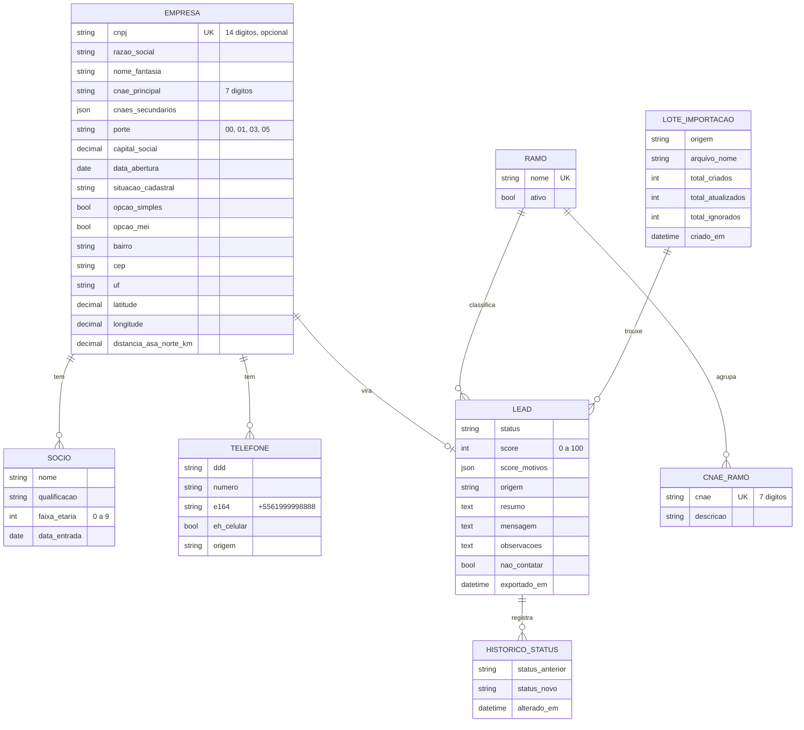

# Modelo de dados e contrato da API

> **Status:** proposta para a issue #9. Revisar em dupla antes de implementar as issues #10, #11, #12 e #13.
>
> Qualquer mudança no modelo ou no formato da API depois de aprovada passa por este documento (combinado da issue #1).

## Visão geral

Os dados ficam divididos em dois apps Django:

| App | Responsável | Modelos | O que guarda |
|---|---|---|---|
| `empresas` | Marcos (#10) | `Empresa`, `Socio`, `Telefone` | Dados cadastrais, vindos da Receita, de CSV ou do Google |
| `leads` | Pedro (#11) | `Ramo`, `CnaeRamo`, `LoteImportacao`, `Lead`, `HistoricoStatus` | O processo de prospecção: status, score, mensagem, origem |

A separação evita que os dois mexam nos mesmos arquivos ao mesmo tempo.



## App `empresas`

### `Empresa`

Um estabelecimento (CNPJ completo, com 14 dígitos). Pode existir **sem CNPJ** quando vem de um CSV do Google Maps, por exemplo.

| Campo | Tipo Django | Observação |
|---|---|---|
| `cnpj` | `CharField(14, unique=True, null=True, blank=True)` | Só dígitos. `null` quando não se sabe |
| `razao_social` | `CharField(255, blank=True)` | |
| `nome_fantasia` | `CharField(255, blank=True)` | Muitas vezes vazio na Receita |
| `cnae_principal` | `CharField(7, blank=True, db_index=True)` | Só dígitos. Ex.: `4761003` |
| `cnaes_secundarios` | `JSONField(default=list)` | Lista de strings de 7 dígitos |
| `natureza_juridica` | `CharField(4, blank=True)` | Código da Receita |
| `porte` | `CharField(2, choices, blank=True)` | `00` não informado, `01` ME, `03` EPP, `05` demais |
| `capital_social` | `DecimalField(15, 2, null=True)` | |
| `data_abertura` | `DateField(null=True)` | |
| `situacao_cadastral` | `CharField(2, choices, blank=True)` | `01` nula, `02` ativa, `03` suspensa, `04` inapta, `08` baixada |
| `opcao_simples` | `BooleanField(null=True)` | `null` = não informado |
| `opcao_mei` | `BooleanField(null=True)` | |
| `logradouro`, `numero`, `complemento` | `CharField(blank=True)` | |
| `bairro` | `CharField(100, blank=True, db_index=True)` | |
| `cep` | `CharField(8, blank=True)` | Só dígitos |
| `municipio` | `CharField(100, blank=True)` | |
| `uf` | `CharField(2, blank=True)` | |
| `email` | `EmailField(blank=True)` | |
| `site` | `URLField(blank=True)` | Vem do Google ou do CSV |
| `latitude`, `longitude` | `DecimalField(9, 6, null=True)` | Preenchidos na Fase 4 (#23) |
| `distancia_asa_norte_km` | `DecimalField(6, 2, null=True)` | Preenchido na Fase 4 (#23) |
| `criado_em`, `atualizado_em` | `DateTimeField(auto_now_add / auto_now)` | |

**Propriedade calculada:** `nome_exibicao` → `nome_fantasia` ou, se vazio, `razao_social`.

### `Socio`

| Campo | Tipo Django | Observação |
|---|---|---|
| `empresa` | `ForeignKey(Empresa, related_name="socios", on_delete=CASCADE)` | |
| `nome` | `CharField(255)` | |
| `qualificacao` | `CharField(100, blank=True)` | Ex.: "Sócio-Administrador" |
| `faixa_etaria` | `PositiveSmallIntegerField(choices, null=True)` | Códigos da Receita, abaixo |
| `data_entrada` | `DateField(null=True)` | |

Faixa etária (Receita): `0` não se aplica, `1` 0–12, `2` 13–20, `3` 21–30, `4` 31–40, `5` 41–50, `6` 51–60, `7` 61–70, `8` 71–80, `9` acima de 80.

### `Telefone`

| Campo | Tipo Django | Observação |
|---|---|---|
| `empresa` | `ForeignKey(Empresa, related_name="telefones", on_delete=CASCADE)` | |
| `ddd` | `CharField(2)` | |
| `numero` | `CharField(9)` | Só dígitos |
| `e164` | `CharField(14)` | Ex.: `+5561999998888`. Gerado pelo serviço da #14 |
| `eh_celular` | `BooleanField(default=False)` | Regra da #14 |
| `origem` | `CharField(choices)` | `receita`, `csv`, `google`, `manual` |

**Restrição:** `UniqueConstraint(fields=["empresa", "e164"])`, para não repetir o mesmo número na mesma empresa.

## App `leads`

### `Ramo` e `CnaeRamo`

Traduzem o CNAE da Receita para o "ramo PCI" usado nos filtros e no score.

| Modelo | Campo | Tipo Django | Observação |
|---|---|---|---|
| `Ramo` | `nome` | `CharField(100, unique=True)` | Ex.: "Papelaria" |
| `Ramo` | `ativo` | `BooleanField(default=True)` | Ramo-alvo da prospecção |
| `CnaeRamo` | `cnae` | `CharField(7, unique=True)` | Só dígitos |
| `CnaeRamo` | `descricao` | `CharField(255)` | Descrição oficial do CNAE |
| `CnaeRamo` | `ramo` | `ForeignKey(Ramo, related_name="cnaes", on_delete=PROTECT)` | |

Carga inicial (migração de dados):

| CNAE | Descrição | Ramo |
|---|---|---|
| `9602501` | Cabeleireiros, manicure e pedicure | Salão / Barbearia |
| `4761003` | Comércio varejista de artigos de papelaria | Papelaria |
| `9609208` | Higiene e embelezamento de animais domésticos | Pet shop |
| `4789004` | Comércio varejista de animais vivos e de artigos e alimentos para animais de estimação | Pet shop |

### `LoteImportacao`

| Campo | Tipo Django | Observação |
|---|---|---|
| `origem` | `CharField(choices)` | `receita`, `csv`, `google`, `manual` |
| `arquivo_nome` | `CharField(255, blank=True)` | |
| `criado_por` | `ForeignKey(User, null=True, on_delete=SET_NULL)` | |
| `criado_em` | `DateTimeField(auto_now_add=True)` | |
| `total_lidos`, `total_criados`, `total_atualizados`, `total_ignorados` | `PositiveIntegerField(default=0)` | |
| `relatorio` | `JSONField(default=dict)` | Motivos dos ignorados, erros |

### `Lead`

Um lead é **uma empresa dentro do processo de prospecção**. Cada empresa tem no máximo um lead.

| Campo | Tipo Django | Observação |
|---|---|---|
| `empresa` | `OneToOneField(Empresa, related_name="lead", on_delete=CASCADE)` | |
| `ramo` | `ForeignKey(Ramo, null=True, blank=True, on_delete=SET_NULL)` | Vem do CNAE ou é definido à mão |
| `status` | `CharField(20, choices, default="novo", db_index=True)` | Ver funil abaixo |
| `score` | `PositiveSmallIntegerField(null=True)` | 0 a 100. Fase 5 (#29) |
| `score_motivos` | `JSONField(default=list)` | Ex.: `["Ramo papelaria (+20)"]` |
| `origem` | `CharField(choices)` | `receita`, `csv`, `google`, `manual` |
| `lote` | `ForeignKey(LoteImportacao, null=True, on_delete=SET_NULL)` | De qual importação veio |
| `resumo` | `TextField(blank=True)` | Fase 4 (#24) |
| `mensagem` | `TextField(blank=True)` | Fase 4 (#25) |
| `observacoes` | `TextField(blank=True)` | Anotações de quem prospecta |
| `nao_contatar` | `BooleanField(default=False, db_index=True)` | Opt-out (LGPD) |
| `nao_contatar_motivo` | `CharField(255, blank=True)` | |
| `nao_contatar_em` | `DateTimeField(null=True)` | |
| `exportado_em` | `DateTimeField(null=True)` | Última exportação para a Redrive |
| `criado_em`, `atualizado_em` | `DateTimeField(auto_now_add / auto_now)` | |

**Funil (`status`):**

```text
novo → exportado → contatado → respondeu → reuniao → fechou
                                                  ↘ perdido (de qualquer etapa)
```

### `HistoricoStatus` (implementado na #21)

| Campo | Tipo Django |
|---|---|
| `lead` | `ForeignKey(Lead, related_name="historico", on_delete=CASCADE)` |
| `status_anterior` | `CharField(20)` |
| `status_novo` | `CharField(20)` |
| `alterado_por` | `ForeignKey(User, null=True, on_delete=SET_NULL)` |
| `alterado_em` | `DateTimeField(auto_now_add=True)` |

## Contrato da API

Todas as rotas exigem login (`Authorization: Token <token>`), exceto `/api/auth/login/`.

| Método | Rota | Descrição | Issue |
|---|---|---|---|
| `POST` | `/api/auth/login/` | Retorna o token | #6 |
| `GET` | `/api/auth/me/` | Usuário logado | #6 |
| `GET` | `/api/leads/` | Lista resumida e paginada | #12, #16 |
| `GET` | `/api/leads/{id}/` | Detalhe completo | #12 |
| `PATCH` | `/api/leads/{id}/` | Altera `status`, `observacoes`, `nao_contatar`, `nao_contatar_motivo` | #12 |
| `GET` | `/api/ramos/` | Lista de ramos | #12 |

### `GET /api/leads/` — lista

A paginação entra na #16; até lá, a lista pode vir sem `count`, `next` e `previous`.

```json
{
  "count": 1234,
  "next": "http://localhost:8000/api/leads/?page=2",
  "previous": null,
  "results": [
    {
      "id": 42,
      "nome": "Quente Brinquedos e Papelaria",
      "ramo": { "id": 3, "nome": "Papelaria" },
      "bairro": "Asa Norte",
      "telefone_principal": "+5561999998888",
      "porte": "01",
      "status": "novo",
      "score": 72,
      "distancia_km": "1.80",
      "nao_contatar": false
    }
  ]
}
```

`nome` é o `nome_exibicao` da empresa. `telefone_principal` é o primeiro celular; se não houver celular, é o primeiro telefone; se não houver nenhum, é `null`.

### `GET /api/leads/{id}/` — detalhe

```json
{
  "id": 42,
  "status": "novo",
  "score": 72,
  "score_motivos": ["Ramo papelaria (+20)", "A 1,8 km da Asa Norte (+15)"],
  "origem": "receita",
  "resumo": "",
  "mensagem": "",
  "observacoes": "",
  "nao_contatar": false,
  "nao_contatar_motivo": "",
  "exportado_em": null,
  "ramo": { "id": 3, "nome": "Papelaria" },
  "empresa": {
    "cnpj": "12345678000190",
    "razao_social": "QUENTE COMERCIO DE BRINQUEDOS LTDA",
    "nome_fantasia": "Quente Brinquedos e Papelaria",
    "nome_exibicao": "Quente Brinquedos e Papelaria",
    "cnae_principal": "4761003",
    "cnaes_secundarios": ["4763601"],
    "porte": "01",
    "capital_social": "10000.00",
    "data_abertura": "2015-03-10",
    "situacao_cadastral": "02",
    "opcao_simples": true,
    "opcao_mei": false,
    "endereco": {
      "logradouro": "SCLN 210 Bloco A",
      "numero": "10",
      "complemento": "Loja 5",
      "bairro": "Asa Norte",
      "cep": "70862510",
      "municipio": "Brasília",
      "uf": "DF"
    },
    "email": "contato@exemplo.com.br",
    "site": "",
    "latitude": "-15.761200",
    "longitude": "-47.883100",
    "distancia_asa_norte_km": "1.80",
    "socios": [
      { "nome": "MARIA DA SILVA", "qualificacao": "Sócio-Administrador", "faixa_etaria": 4 }
    ],
    "telefones": [
      { "e164": "+5561999998888", "ddd": "61", "numero": "999998888", "eh_celular": true, "origem": "receita" }
    ]
  },
  "criado_em": "2026-10-08T14:30:00-03:00",
  "atualizado_em": "2026-10-08T14:30:00-03:00"
}
```

Os dados acima são **fictícios**, só para mostrar o formato.

### `PATCH /api/leads/{id}/`

Corpo (todos os campos opcionais):

```json
{ "status": "contatado", "observacoes": "Pediu para ligar na segunda", "nao_contatar": false }
```

Resposta: o detalhe completo do lead, no mesmo formato do `GET`.

### `GET /api/ramos/`

```json
[
  { "id": 1, "nome": "Salão / Barbearia", "ativo": true },
  { "id": 2, "nome": "Pet shop", "ativo": true },
  { "id": 3, "nome": "Papelaria", "ativo": true }
]
```

## Tipos no frontend (TypeScript)

Arquivo sugerido: `frontend/src/types/lead.ts` (issue #13).

```ts
export type StatusLead =
  | "novo" | "exportado" | "contatado" | "respondeu" | "reuniao" | "fechou" | "perdido";

export type Origem = "receita" | "csv" | "google" | "manual";

export interface Ramo {
  id: number;
  nome: string;
  ativo?: boolean;
}

export interface Telefone {
  e164: string;
  ddd: string;
  numero: string;
  eh_celular: boolean;
  origem: Origem;
}

export interface Socio {
  nome: string;
  qualificacao: string;
  faixa_etaria: number | null;
}

export interface Endereco {
  logradouro: string;
  numero: string;
  complemento: string;
  bairro: string;
  cep: string;
  municipio: string;
  uf: string;
}

export interface Empresa {
  cnpj: string | null;
  razao_social: string;
  nome_fantasia: string;
  nome_exibicao: string;
  cnae_principal: string;
  cnaes_secundarios: string[];
  porte: "" | "00" | "01" | "03" | "05";
  capital_social: string | null;
  data_abertura: string | null;
  situacao_cadastral: string;
  opcao_simples: boolean | null;
  opcao_mei: boolean | null;
  endereco: Endereco;
  email: string;
  site: string;
  latitude: string | null;
  longitude: string | null;
  distancia_asa_norte_km: string | null;
  socios: Socio[];
  telefones: Telefone[];
}

export interface LeadResumo {
  id: number;
  nome: string;
  ramo: Ramo | null;
  bairro: string;
  telefone_principal: string | null;
  porte: string;
  status: StatusLead;
  score: number | null;
  distancia_km: string | null;
  nao_contatar: boolean;
}

export interface LeadDetalhe {
  id: number;
  status: StatusLead;
  score: number | null;
  score_motivos: string[];
  origem: Origem;
  resumo: string;
  mensagem: string;
  observacoes: string;
  nao_contatar: boolean;
  nao_contatar_motivo: string;
  exportado_em: string | null;
  ramo: Ramo | null;
  empresa: Empresa;
  criado_em: string;
  atualizado_em: string;
}

export interface Paginado<T> {
  count: number;
  next: string | null;
  previous: string | null;
  results: T[];
}
```

Os campos decimais (`capital_social`, `latitude`, `distancia_km` etc.) chegam como **texto**, porque é assim que o Django REST Framework envia `DecimalField` por padrão.

## Decisões para fechar em dupla

- [ ] Dois apps (`empresas` e `leads`) ou tudo em `leads`?
- [ ] Um lead por empresa (`OneToOne`) está bom? Ou a mesma empresa pode voltar a ser prospectada depois de "perdido" como um lead novo?
- [ ] Os nomes dos status do funil estão bons?
- [ ] Guardar só o CNPJ completo (14 dígitos) ou separar matriz e filiais?
- [ ] O modelo `Lead` atual (com `name`, `company`, `email`...) será **substituído**. Como ainda não há dados reais, podemos apagar a tabela antiga e começar as migrações do zero?
- [ ] Algum campo faltando para a Redrive? Revisar quando a #7 (demonstração da Redrive) for concluída.